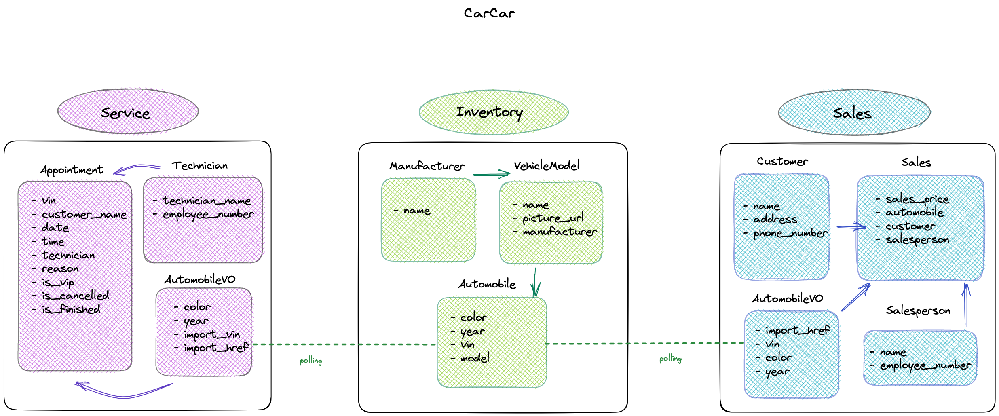
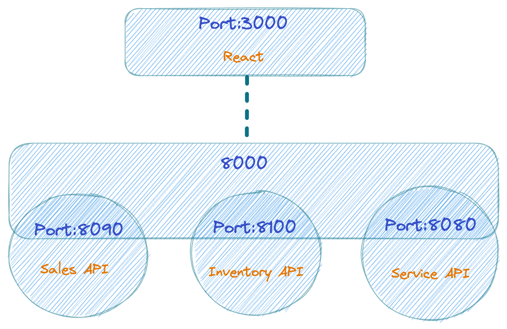

# CarCar
CarCar is a web application that allows car dealerships to manage their inventory, service, and sales

Team:

* John Agni - Sales Microservice/Inventory Lists
* Charlene Xu - Service Microservice/Inventory Forms

## Design





* Front-end: We use React to create a front-end application that uses the RESTFUL APIs.
* Back-end: We use Django framework to create RESTful APIs in microservices.

## Instructions to run the project

1. Go to https://gitlab.com/charlene.xu92/project-beta and Fork the Repository
2. Select the Clone option and copy the URL under HTTPS.
3. In your terminal, enter `cd` to your projects directory.
4. Enter the command: `git clone https://gitlab.com/charlene.xu92/project-beta`.
5. After the project is cloned, `cd` to the newly cloned project directory.
6. Make sure you have your Docker Desktop installed and up.
7. In your terminal, run following commands:
    ```
    docker volume create project-beta
    docker-compose build
    docker-compose up
    ```
8. Visit http://localhost:3000 in the browser.

## Inventory microservice

**URL and port:** http://localhost:8100/

The Inventory microservice allows the users to create manufacturer, vehicle model, and automibile. Users can also check the manufacturers list, vehicle models list, and automobiles list.

### Models
* Manufacturer
* VehicleModel
* Automobile

## **Manufacturers**
| Action              | Method | URL                                    |
| ------------------- | ------ | -------------------------------------- |
| List Manufacturers   | GET    | http://localhost:8100/api/manufacturers/ |
| Create a manufacturer | POST   | http://localhost:8100/api/manufacturers/ |
| Get a specific manufacturer | GET   | http://localhost:8100/api/manufacturers/:id/ |
| Update a specific manufacturer | PUT   | http://localhost:8100/api/manufacturers/:id/ |
| Delete a specific manufacturer | DELETE   | http://localhost:8100/api/manufacturers/:id/ |

Creating and updating a manufacturer requires only the manufacturer's name.

```
{
  "name": "Chrysler"
}
```

The return value of creating, getting, and updating a single manufacturer is its name, href, and id.

```
{
  "href": "/api/manufacturers/1/",
  "id": 1,
  "name": "Chrysler"
}
```

The list of manufacturers is a dictionary with the key "manufacturers" set to a list of manufacturers.

```
{
  "manufacturers": [
    {
      "href": "/api/manufacturers/1/",
      "id": 1,
      "name": "Daimler-Chrysler"
    }
  ]
}
```

## **Vehicle models**

| Action              | Method | URL                                    |
| ------------------- | ------ | -------------------------------------- |
| List vehicle models   | GET    | http://localhost:8100/api/manufacturers/ |
| Create a manufacturer | POST   | http://localhost:8100/api/manufacturers/ |
| Get a specific manufacturer | GET   | http://localhost:8100/api/manufacturers/:id/ |
| Update a specific manufacturer | PUT   | http://localhost:8100/api/manufacturers/:id/ |
| Delete a specific manufacturer | DELETE   | http://localhost:8100/api/manufacturers/:id/ |

Creating and updating a vehicle model requires the model name, a URL of an image, and the id of the manufacturer.

```
{
  "name": "Sebring",
  "picture_url": "https://upload.wikimedia.org/wikipedia/commons/thumb/7/71/Chrysler_Sebring_front_20090302.jpg/320px-Chrysler_Sebring_front_20090302.jpg",
  "manufacturer_id": 1
}
```

Updating a vehicle model can take the name and/or the picture URL.
```
{
  "name": "Sebring",
  "picture_url": "https://upload.wikimedia.org/wikipedia/commons/thumb/7/71/Chrysler_Sebring_front_20090302.jpg/320px-Chrysler_Sebring_front_20090302.jpg"
}
```

Getting the detail of a vehicle model, or the return value from creating or updating a vehicle model, returns the model's information and the manufacturer's information.

```
{
  "href": "/api/models/1/",
  "id": 1,
  "name": "Sebring",
  "picture_url": "https://upload.wikimedia.org/wikipedia/commons/thumb/7/71/Chrysler_Sebring_front_20090302.jpg/320px-Chrysler_Sebring_front_20090302.jpg",
  "manufacturer": {
    "href": "/api/manufacturers/1/",
    "id": 1,
    "name": "Daimler-Chrysler"
  }
}
```

Getting a list of vehicle models returns a list of the detail information with the key "models".
```
{
  "models": [
    {
      "href": "/api/models/1/",
      "id": 1,
      "name": "Sebring",
      "picture_url": "https://upload.wikimedia.org/wikipedia/commons/thumb/7/71/Chrysler_Sebring_front_20090302.jpg/320px-Chrysler_Sebring_front_20090302.jpg",
      "manufacturer": {
        "href": "/api/manufacturers/1/",
        "id": 1,
        "name": "Daimler-Chrysler"
      }
    }
  ]
}
```

## **Automobile information**

***Note: The identifiers for automobiles in this API are not integer ids. They are the Vehicle Identification Number (VIN) for the specific automobile.***

| Action              | Method | URL                                    |
| ------------------- | ------ | -------------------------------------- |
| List automobiles   | GET    | http://localhost:8100/api/automobiles/ |
| Create an automobile | POST   | http://localhost:8100/api/automobiles/ |
| Get a specific automobile | GET   | http://localhost:8100/api/automobiles/:vin/ |
| Update a specific automobile | PUT   | http://localhost:8100/api/automobiles/:vin/ |
| Delete a specific automobile | DELETE   | http://localhost:8100/api/automobiles/:vin/ |

You can create an automobile with its color, year, VIN, and the id of the vehicle model.

```
{
  "color": "red",
  "year": 2012,
  "vin": "1C3CC5FB2AN120174",
  "model_id": 1
}
```

As noted, you query an automobile by its VIN. For example, you would use the URL

http://localhost:8100/api/automobiles/1C3CC5FB2AN120174/

to get the details for the car with the VIN "1C3CC5FB2AN120174". The details for an automobile include its model and manufacturer.

```
{
  "href": "/api/automobiles/1C3CC5FB2AN120174/",
  "id": 1,
  "color": "yellow",
  "year": 2013,
  "vin": "1C3CC5FB2AN120174",
  "model": {
    "href": "/api/models/1/",
    "id": 1,
    "name": "Sebring",
    "picture_url": "https://upload.wikimedia.org/wikipedia/commons/thumb/7/71/Chrysler_Sebring_front_20090302.jpg/320px-Chrysler_Sebring_front_20090302.jpg",
    "manufacturer": {
      "href": "/api/manufacturers/1/",
      "id": 1,
      "name": "Daimler-Chrysler"
    }
  }
}
```

You can update the color and/or year of an automobile.

```
{
  "color": "red",
  "year": 2012
}
```

Getting a list of automobiles returns a dictionary with the key "autos" set to a list of automobile information.
```
{
  "autos": [
    {
      "href": "/api/automobiles/1C3CC5FB2AN120174/",
      "id": 1,
      "color": "yellow",
      "year": 2013,
      "vin": "1C3CC5FB2AN120174",
      "model": {
        "href": "/api/models/1/",
        "id": 1,
        "name": "Sebring",
        "picture_url": "https://upload.wikimedia.org/wikipedia/commons/thumb/7/71/Chrysler_Sebring_front_20090302.jpg/320px-Chrysler_Sebring_front_20090302.jpg",
        "manufacturer": {
          "href": "/api/manufacturers/1/",
          "id": 1,
          "name": "Daimler-Chrysler"
        }
      }
    }
  ]
}
```


## Service microservice

**URL and port:** http://localhost:8080/

Service microservice has three models: AutomobileVO, Technician, and Appointment. It helps the users to manage the service appointments easily. The Service polls data from the Inventory through AutomobileVO and uses the VIN data to determine the VIP status in an appointment. The components of this microservice includes creating a technician, creating a service appointment, displaying service appointment list, and searching the appointment history by VIN.

**Polling**

Service microservice polls the Inventory microservice every 60 seconds for automobile updates.

**Models**

* AutomobileVO (Value Object)
    - color: string
    - year: integer
    - import_vin: string
    - import_href: string

* Technician(Entity)
    - technician_name: string
    - employee_number: integer

* Appointment(Entity)
    - vin: string
    - customer_name: string
    - date: date
    - time: time
    - technician: (a ForeignKey of Technician model)
    - reason: string
    - is_vip: boolean
    - is_cancelled: boolean
    - is_finished: boolean

**Components**

* TechnicianForm
    - allows a person to enter an automotive technician's name and employee number. When the form is submitted, the automotive technician is created in the application.
    - navigate to http://localhost:3000/technicians/new or click Services in the navigation bar.

* ServiceAppointmentForm
    - allows a service concierge to enter the VIN of the vehicle, the name of the person to whom the vehicle belongs, the date and time of the appointment, the assigned technician, and a reason for the service appointment (like "oil change" or "routine maintenance"). When the form is submitted, the service appointment should be saved in the application.
    - navigate to http://localhost:3000/appointments/new or click Services in the navigation bar.

* ServiceAppointmentList
    - show a list of scheduled appointments that contain the details collected in the form: VIN, customer name, date and time of the appointment, the assigned technician's name, and the reason for the service. If the VIN is for an automobile that was at one time in the inventory, then the automobile was purchased from the dealership. The list of scheduled appointments should display the VIP status so that the concierge can give that customer "VIP treatment". Each appointment in the list of appointments have a button that allows a service concierge to cancel the appointment, or to show that the service appointment has been finished. When a service appointment is canceled or finished, it should no longer show up in the list of appointments.
    - navigate to http://localhost:3000/appointments/ or click Services in the navigation bar.

* ServiceHistory
    - show a list of the service appointments for a specific VIN. The list of service appointments include the customer name, date and time of the appointment, the assigned technician's name, and the reason for the service.
    - navigate to http://localhost:3000/search/ or click Services in the navigation bar.

### CRUD Routes

#### AutomobileVO (Value Object)
The AutomobileVO model is a value object. It's used to poll VIN data from the Inventory microservice. If the VIN is for an automobile that was at one time in the inventory, then the automobile was purchased from the dealership. The list of scheduled appointments should show that the automobile was purchased from the dealership so that the concierge can give that customer "VIP treatment".

**List view of automobilesVO from polling service**
* request method => `GET`: http://localhost:8080/api/automobiles/
* sample GET request =>
```
{
	"autos": [
		{
			"import_href": "/api/automobiles/1C3CC5FB2AN120172/",
			"import_vin": "1C3CC5FB2AN120172",
			"color": "red",
			"year": 2012
		},
		{
			"import_href": "/api/automobiles/WAUVT68E72A180359/",
			"import_vin": "WAUVT68E72A180359",
			"color": "Silver",
			"year": 2008
		},
		{
			"import_href": "/api/automobiles/WAUAF98E78A128813/",
			"import_vin": "WAUAF98E78A128813",
			"color": "blue",
			"year": 2008
		}
	]
}
```

#### Technicians
The technician model is an entity and is used to create technician and get a list of technicians, and get a detail view of technician with technician name and employee number. It's also a foreign key for the Appointment model.

* request method => `GET`: http://localhost:8080/api/technicians/
* request method => `POST`: http://localhost:8080/api/technicians/<:id>/
* request method => `DELETE`: http://localhost:8080/api/technicians/<:id>/

* sample POST request for create view =>
```
{
    "technician_name": "Calanthe Melody",
    "employee_number": 153440
}
```

* sample POST return for create view =>
```
{
	"href": "/api/technicians/11/",
	"technician_name": "Calanthe Melody",
	"employee_number": 153440,
	"id": 11
}
```

* sample GET for list view =>
```
{
	"technicians": [
		{
			"href": "/api/technicians/10/",
			"technician_name": "Haruto Jeannine",
			"employee_number": 153430,
			"id": 10
		},
		{
			"href": "/api/technicians/11/",
			"technician_name": "Calanthe Melody",
			"employee_number": 153440,
			"id": 11
		}
	]
}
```

* sample GET request return for detail view =>
```
{
	"href": "/api/technicians/11/",
	"technician_name": "Calanthe Melody",
	"employee_number": 153440,
	"id": 11
}
```

#### Appointments
The Appointment model is also an entity because it has a life cycle (active, cancel, or finished). Each appointment instance consists of VIN, customer name, date/time, assigned technician, and reason for service. It also allows us to check a service history by using the VIN. Additioanlly, if the VIN in appointment matches the VIN in the inventory, a VIP indicator will be given.

* request method => `GET`: http://localhost:8080/api/appointments/
* request method => `POST`: http://localhost:8080/api/appointments/
* request method => `PUT`: http://localhost:8080/api/appointments/<:id>/
* request method => `DELETE`: http://localhost:8080/api/appointments/<:id>/

* sample POST request for create view =>
In this example, the VIN is the same as the VIN in Inventory, so it should indicates that is_vip: true in the detail view.
```
{
	"vin": "5UXKU6C51G0R34085",
	"customer_name": "Chloe Isiah",
	"date": "2023-06-11",
	"time": "12:30",
	"technician": 11,
	"reason": "tire change"
}
```

* sample GET request for list view =>
```
{
	"appointments": [
		{
			"href": "/api/appointments/46/",
			"vin": "5UXKU6C51G0R34085",
			"customer_name": "Gwenevere Marlon",
			"technician": {
				"href": "/api/technicians/8/",
				"technician_name": "Caroline Ruby",
				"employee_number": 153420,
				"id": 8
			},
			"reason": "filter change",
			"is_vip": true,
			"is_cancelled": false,
			"is_finished": true,
			"id": 46,
			"date": "2023-03-21",
			"time": "10:30:00"
		},
		{
			"href": "/api/appointments/48/",
			"vin": "5UXKU6C51G0R34085",
			"customer_name": "Chloe Isiah",
			"technician": {
				"href": "/api/technicians/11/",
				"technician_name": "Calanthe May",
				"employee_number": 153440,
				"id": 11
			},
			"reason": "tire change",
			"is_vip": true,
			"is_cancelled": false,
			"is_finished": false,
			"id": 48,
			"date": "2023-06-11",
			"time": "12:30:00"
		}
	]
}
```

* sample GET request return for detail view =>
```
{
	"href": "/api/appointments/48/",
	"vin": "5UXKU6C51G0R34085",
	"customer_name": "Chloe Isiah",
	"technician": {
		"href": "/api/technicians/11/",
		"technician_name": "Calanthe May",
		"employee_number": 153440,
		"id": 11
	},
	"reason": "tire change",
	"is_vip": true,
	"is_cancelled": false,
	"is_finished": false,
	"id": 48,
	"date": "2023-06-11",
	"time": "12:30:00"
}
```

* sample PUT request to update appointment =>
```
{
	"id": 48,
	"is_cancelled": false,
	"is_finished": true
}
```

* sample return after the PUT request =>
```
{
	"href": "/api/appointments/48/",
	"vin": "5UXKU6C51G0R34085",
	"customer_name": "Chloe Isiah",
	"technician": {
		"href": "/api/technicians/11/",
		"technician_name": "Calanthe May",
		"employee_number": 153440,
		"id": 11
	},
	"reason": "tire change",
	"is_vip": true,
	"is_cancelled": false,
	"is_finished": true,
	"id": 48,
	"date": "2023-06-11",
	"time": "12:30:00"
}
```

# Sales microservice

URL and port: http://localhost:8090/


The Sales microservice is responsible for managing sales data, which includes sales persons, customers, sales records, and inventory of automobiles. This microservice is divided into two applications - Sales API and Sales Poller.

Sales API is a Django-based application that hosts the models, URLs, and views. It is accessible through Insomnia on port 8090.

Sales Poller is a polling application that periodically requests automobile data from the Inventory API. It creates a new instance of the automobileVO in the Sales microservice database for every instance of the Automobile in the Inventory database.

## AutomobileVO (Value Object)

The `AutomobileVO` model is a value object. It is used by the Sales microservice to poll  data such as VIN, Color, and year from the Inventory microservice. It is needed because that data are then used to create and manage sales of automobiles in the inventory. This also ensures that automobiles that are already sold in our inventory are not available for purchase on the Create a sale record form.


## Customer

The `Customer` model is a django model that represents a customer entity in the system. It has a foreign key relationship with the `Sale` model. Each sale object is associated with one customer object.

| Actions          | Method | URL                                    |
|------------------|--------|----------------------------------------|
| List Customers   | `GET`    | http://localhost:8090/api/customers/   |
| Create a Customer| `POST`   | http://localhost:8090/api/customers/   |

- Sample `POST` request for create view =>

```

{
	"name": "Steve Jobs",
	"address": "1 Apple Park Way, Cupertino, CA 95014",
	"phone_number": 5108521579
}


```

- Sample `GET` for list view =>

```
[
	{
		"name": "Steve Jobs",
	    "address": "1 Apple Park Way, Cupertino, CA 95014",
	    "phone_number": 5108521579
		"id": 1
	},
	{
		"name": "Joe Biden",
		"address": "1600 Pennsylvania Avenue NW, Washington, DC 20500",
		"phone_number": 8081234567,
		"id": 2
	}
]

```


### How to create a customer
1. Navigate to http://localhost:3000/customers/new or Sales in the navigation bar and click Become a customer
2. Input Name, Address, and Phone Number of customer
3. Click Create, upon sucessful creation sucess message should show


## Sales person

The `Salesperson` model represents a salesperson entity in the system. It has a foreign key relationship with the `Sale` model . Each sale object is associated with one `Salesperson` object.


| Actions          | Method | URL                                    |
|------------------|--------|----------------------------------------|
| List Sales People   | `GET`    | http://localhost:8090/api/salespeople/   |
| Create a Sales Person | `POST`   | http://localhost:8090/api/salespeople/  |

- Sample `POST` request for create view =>

```

{
	"name": "Don Julio",
	"employee_number": 1942
}

```

- Sample `GET` request for list view =>
```
{
	"salespersons": [
		{
			"name": "Don Julio",
			"employee_number": 1942,
			"id": 1
		},
		{
			"name": "Remy Martin",
			"employee_number": 1738,
			"id": 2
		}
}

```

### How to create a new sales person
1. Navigate to http://localhost:3000/salesperson/new or in the navigation bar click Sales then click Become a sales person
2. Enter Name and Emplyee ID of sales person ***Note: Employee ID is max 5 digits.***
3. Click create, upon successful creatiion success message should show


# Sale

The `Sale` model represents a sales record in the system, which captures information about a specific sale, the automobile sold, person who made the sale, and customer who bought the automobile. It has foreign key relationships with `AutomobileVO`, `Salesperson`, and `Customer`. Each object is associated with one automobile, one salesperson and optionally one customer object.


| Actions          | Method | URL                                    |
|------------------|--------|----------------------------------------|
| List Sales Records   | `GET`    | http://localhost:8090/api/sales/   |
| Sales person history | `GET` | http://localhost:8090/api/salesperson/:id/sales |
| Create a Sales Record | `POST`   | http://localhost:8090/api/salesrecords/  |

- Sample `POST` request for create view (Sales Records) =>

```
{
	"sale_price": 50000,
	"vin": "4T3ZF13C5YU267563",
	"salesperson": 1,
	"customer": 1
}

```

- Sample `GET` request for list view (List Sales Records) =>

```
{
	"sales": [
		{
			"salesperson": "Jack Nicholson",
			"customer": "Kevin McCallister",
			"vin": "JH4KA3250KC009863",
			"sale_price": 50000,
			"id": 3,
			"employee_number": 1
		},
		{
			"salesperson": "Jack Black",
			"customer": "Jimmy Fallon",
			"vin": "JH4DA3340HS032394",
			"sale_price": 50000,
			"id": 4,
			"employee_number": 2
		}
  ]
}

```


- Sample `GET` request for list view (Sales Person History) =>


```
[
	{
		"salesperson": "John Adams",
		"customer": "James Bond",
		"vin": "JH4DA3340HS032394",
		"sale_price": 5000,
		"id": 1,
		"employee_number": 808
	},
	{
		"salesperson": "John Adams",
		"customer": "Edward Cullen",
		"vin": "4T3ZF13C5YU267563",
		"sale_price": 123,
		"id": 2,
		"employee_number": 808
	}
]
```


### How to create a new Sales Record
1. Navigate to http://localhost:3000/sales/new or Sales in the navigation bar then click Create a new sales record. Alternatively you can navigate to http://localhost:3000/sales and click Create a Sale
2. Select option in Choose an Automobile in which you would like to be sold ***Note: Automobiles which have already been sold will not appear in the dropdown. If no options appear you need to Create Automobile***
3. Select option in Choose a Sales Person in which is selling the automobile  ***Note: If no options appear you need to create a sales person see How to create a new sales person.***
4. Select option in Choose a Customer in which is buying the automobile ***Note: If no options appear you need to create a Customer see How to create a new customer.***
5. Input sale price in USD
6. Click Create, upon successful creation you will be redirected to the list of sales page (http://localhost:3000/sales)


### How to view all sales
1. Navigate to http://localhost:3000/sales or Click Sales in the navigation bar then click list of sales Salesperson history


### How to view Sales Person history
1. Navigate to http://localhost:3000/salesperson/history or Click sales in the navigation bar then click Salesperson history
2. Select option in Choose a Salesperson to display all the sales that person has made
