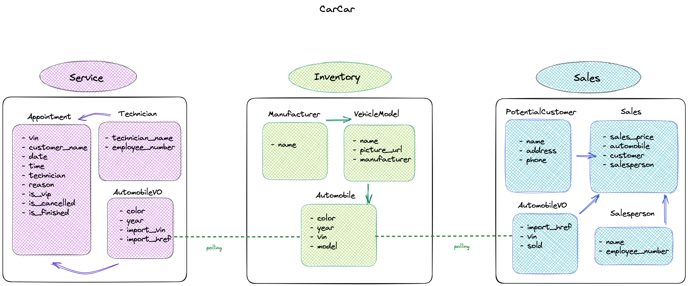

# CarCar

Team:

* John Agni - Sales Microservice/Inventory Lists
* Charlene Xu - Service Microservice/Inventory Forms

## Design




* Front-end: We use React to create a front-end application that uses the RESTFUL APIs.
* Back-end: We use Django framework to create RESTful APIs in microservices.

## Instructions to run the project

1. Go to https://gitlab.com/charlene.xu92/project-beta for the repo.
2. Select the Clone option and copy the URL under HTTPS.
3. In your terminal, enter `cd` to your projects directory.
4. Enter the command: `git clone https://gitlab.com/charlene.xu92/project-beta`.
5. After the project is cloned, `cd` to the newly cloned project directory.
6. Make sure you have your Docker Desktop installed and up.
7. In your terminal, run following commands:
    ```
    docker volume create project-beta
    docker-compose build
    docker-compose up
    ```
8. Visit http://localhost:3000 in the browser.

## Inventory microservice
**URL and port:** http://localhost:8100/


## **Manufacturers**
| Action              | Method | URL                                    |
| ------------------- | ------ | -------------------------------------- |
| List Manufacturers   | GET    | http://localhost:8100/api/manufacturers/ |
| Create a manufacturer | POST   | http://localhost:8100/api/manufacturers/ |
| Get a specific manufacturer | GET   | http://localhost:8100/api/manufacturers/:id/ |
| Update a specific manufacturer | PUT   | http://localhost:8100/api/manufacturers/:id/ |
| Delete a specific manufacturer | DELETE   | http://localhost:8100/api/manufacturers/:id/ |

Creating and updating a manufacturer requires only the manufacturer's name.

```
{
  "name": "Chrysler"
}
```

The return value of creating, getting, and updating a single manufacturer is its name, href, and id.

```
{
  "href": "/api/manufacturers/1/",
  "id": 1,
  "name": "Chrysler"
}
```

The list of manufacturers is a dictionary with the key "manufacturers" set to a list of manufacturers.

```
{
  "manufacturers": [
    {
      "href": "/api/manufacturers/1/",
      "id": 1,
      "name": "Daimler-Chrysler"
    }
  ]
}
```

## **Vehicle models**

| Action              | Method | URL                                    |
| ------------------- | ------ | -------------------------------------- |
| List vehicle models   | GET    | http://localhost:8100/api/manufacturers/ |
| Create a manufacturer | POST   | http://localhost:8100/api/manufacturers/ |
| Get a specific manufacturer | GET   | http://localhost:8100/api/manufacturers/:id/ |
| Update a specific manufacturer | PUT   | http://localhost:8100/api/manufacturers/:id/ |
| Delete a specific manufacturer | DELETE   | http://localhost:8100/api/manufacturers/:id/ |

Creating and updating a vehicle model requires the model name, a URL of an image, and the id of the manufacturer.

```
{
  "name": "Sebring",
  "picture_url": "https://upload.wikimedia.org/wikipedia/commons/thumb/7/71/Chrysler_Sebring_front_20090302.jpg/320px-Chrysler_Sebring_front_20090302.jpg",
  "manufacturer_id": 1
}
```

Updating a vehicle model can take the name and/or the picture URL.
```
{
  "name": "Sebring",
  "picture_url": "https://upload.wikimedia.org/wikipedia/commons/thumb/7/71/Chrysler_Sebring_front_20090302.jpg/320px-Chrysler_Sebring_front_20090302.jpg"
}
```

Getting the detail of a vehicle model, or the return value from creating or updating a vehicle model, returns the model's information and the manufacturer's information.

```
{
  "href": "/api/models/1/",
  "id": 1,
  "name": "Sebring",
  "picture_url": "https://upload.wikimedia.org/wikipedia/commons/thumb/7/71/Chrysler_Sebring_front_20090302.jpg/320px-Chrysler_Sebring_front_20090302.jpg",
  "manufacturer": {
    "href": "/api/manufacturers/1/",
    "id": 1,
    "name": "Daimler-Chrysler"
  }
}
```

Getting a list of vehicle models returns a list of the detail information with the key "models".
```
{
  "models": [
    {
      "href": "/api/models/1/",
      "id": 1,
      "name": "Sebring",
      "picture_url": "https://upload.wikimedia.org/wikipedia/commons/thumb/7/71/Chrysler_Sebring_front_20090302.jpg/320px-Chrysler_Sebring_front_20090302.jpg",
      "manufacturer": {
        "href": "/api/manufacturers/1/",
        "id": 1,
        "name": "Daimler-Chrysler"
      }
    }
  ]
}
```

## **Automobile information**

***Note: The identifiers for automobiles in this API are not integer ids. They are the Vehicle Identification Number (VIN) for the specific automobile.***

| Action              | Method | URL                                    |
| ------------------- | ------ | -------------------------------------- |
| List automobiles   | GET    | http://localhost:8100/api/automobiles/ |
| Create an automobile | POST   | http://localhost:8100/api/automobiles/ |
| Get a specific automobile | GET   | http://localhost:8100/api/automobiles/:vin/ |
| Update a specific automobile | PUT   | http://localhost:8100/api/automobiles/:vin/ |
| Delete a specific automobile | DELETE   | http://localhost:8100/api/automobiles/:vin/ |

You can create an automobile with its color, year, VIN, and the id of the vehicle model.

```
{
  "color": "red",
  "year": 2012,
  "vin": "1C3CC5FB2AN120174",
  "model_id": 1
}
```

As noted, you query an automobile by its VIN. For example, you would use the URL

http://localhost:8100/api/automobiles/1C3CC5FB2AN120174/

to get the details for the car with the VIN "1C3CC5FB2AN120174". The details for an automobile include its model and manufacturer.

```
{
  "href": "/api/automobiles/1C3CC5FB2AN120174/",
  "id": 1,
  "color": "yellow",
  "year": 2013,
  "vin": "1C3CC5FB2AN120174",
  "model": {
    "href": "/api/models/1/",
    "id": 1,
    "name": "Sebring",
    "picture_url": "https://upload.wikimedia.org/wikipedia/commons/thumb/7/71/Chrysler_Sebring_front_20090302.jpg/320px-Chrysler_Sebring_front_20090302.jpg",
    "manufacturer": {
      "href": "/api/manufacturers/1/",
      "id": 1,
      "name": "Daimler-Chrysler"
    }
  }
}
```

You can update the color and/or year of an automobile.

```
{
  "color": "red",
  "year": 2012
}
```

Getting a list of automobiles returns a dictionary with the key "autos" set to a list of automobile information.
```
{
  "autos": [
    {
      "href": "/api/automobiles/1C3CC5FB2AN120174/",
      "id": 1,
      "color": "yellow",
      "year": 2013,
      "vin": "1C3CC5FB2AN120174",
      "model": {
        "href": "/api/models/1/",
        "id": 1,
        "name": "Sebring",
        "picture_url": "https://upload.wikimedia.org/wikipedia/commons/thumb/7/71/Chrysler_Sebring_front_20090302.jpg/320px-Chrysler_Sebring_front_20090302.jpg",
        "manufacturer": {
          "href": "/api/manufacturers/1/",
          "id": 1,
          "name": "Daimler-Chrysler"
        }
      }
    }
  ]
}
```


## Service microservice

**URL and port:** http://localhost:8080/
Service microservice has three models: AutomobileVO, Technician, and Appointment.

### CRUD Routes

#### AutomobileVO (Value Object)
The AutomobileVO model is a value object. It's used to poll VIN data from the Inventory microservice.  If the VIN is for an automobile that was at one time in the inventory, then the automobile was purchased from the dealership. The list of scheduled appointments should show that the automobile was purchased from the dealership so that the concierge can give that customer "VIP treatment".

**List view of automobilesVO from polling service**
* request method => `GET`: http://localhost:8080/api/automobiles/
* sample GET request =>
```
{
	"autos": [
		{
			"import_href": "/api/automobiles/1C3CC5FB2AN120172/",
			"import_vin": "1C3CC5FB2AN120172",
			"color": "red",
			"year": 2012
		},
		{
			"import_href": "/api/automobiles/WAUVT68E72A180359/",
			"import_vin": "WAUVT68E72A180359",
			"color": "Silver",
			"year": 2008
		},
		{
			"import_href": "/api/automobiles/WAUAF98E78A128813/",
			"import_vin": "WAUAF98E78A128813",
			"color": "blue",
			"year": 2008
		}
	]
}
```

#### Technicians
The technician model is an entity and is used to create technician and get a list of technicians, and get a detail view of technician with technician name and employee number. It's also a foreign key for the Appointment model.

* request method => `GET`: http://localhost:8080/api/technicians/
* request method => `POST`: http://localhost:8080/api/technicians/<:id>/
* request method => `PUT`: http://localhost:8080/api/technicians/<:id>/
* request method => `DELETE`: http://localhost:8080/api/technicians/<:id>/

* sample POST request for create view =>
```
{
	"technician_name": "Jackie Hall",
    "employee_number": 121212,
    "id": 1
}
```

* sample GET for list view =>
```
{
	"technicians": [
		{
			"href": "/api/technicians/1/",
			"technician_name": "Jackie Hall",
			"employee_number": 121212,
			"id": 1
		},
		{
			"href": "/api/technicians/2/",
			"technician_name": "Billy Song",
			"employee_number": 153401,
			"id": 2
		}
	]
}
```

* sample REQUEST for detail view =>
```
{
	"href": "/api/technicians/1/",
	"technician_name": "Jackie Hall",
	"employee_number": 121212,
	"id": 1
}
```

#### Appointments
The Appointment model is also an entity because it has a life cycle (active, cancel, or finished). Each appointment instance consists of VIN, customer name, date/time, assigned technician, and reason for service. It also allows us to check a service history by using the VIN. Additioanlly, if the VIN in appointment matches the VIN in the inventory, a VIP indicator will be given.

* request method => `GET`: http://localhost:8080/api/appointments/
* request method => `POST`: http://localhost:8080/api/appointments/
* request method => `PUT`: http://localhost:8080/api/appointments/<:id>/
* request method => `DELETE`: http://localhost:8080/api/appointments/<:id>/

* sample POST request for create view =>
```
{
	"vin": "1C3CC5FB2AN120172",
	"customer_name": "Vip Doe",
	"date": "2023-07-11",
	"time": "12:30",
	"technician": 2,
	"reason": "tire change"
}
```

* sample GET request for list view =>
```
{
	"appointments": [
		{
			"href": "/api/appointments/35/",
			"vin": "WAUBGAFL1EA066230",
			"customer_name": "Sandy Doe",
			"technician": {
				"href": "/api/technicians/2/",
				"technician_name": "Billy Song",
				"employee_number": 153401,
				"id": 2
			},
			"reason": "tire change",
			"is_vip": false,
			"is_cancelled": false,
			"is_finished": true,
			"id": 35,
			"date": "2023-09-11",
			"time": "12:30:00"
		},
		{
			"href": "/api/appointments/44/",
			"vin": "WAUAF98E78A128813",
			"customer_name": "Katsuo Akihito",
			"technician": {
				"href": "/api/technicians/5/",
				"technician_name": "Jason Chan",
				"employee_number": 153405,
				"id": 5
			},
			"reason": "battery change",
			"is_vip": true,
			"is_cancelled": false,
			"is_finished": false,
			"id": 44,
			"date": "2023-03-31",
			"time": "14:30:00"
		}
	]
}
```

* sample GET request for detail view =>
```
{
	"href": "/api/appointments/31/",
	"vin": "4T1BF12B3VU142754",
	"customer_name": "Queenie Doe",
	"technician": {
		"href": "/api/technicians/3/",
		"technician_name": "Benny Kim",
		"employee_number": 153402,
		"id": 3
	},
	"reason": "tire change",
	"is_vip": false,
	"is_cancelled": false,
	"is_finished": true,
	"id": 31,
	"date": "2023-06-11",
	"time": "12:30:00"
}
```


## Sales microservice

Explain your models and integration with the inventory
microservice, here.
